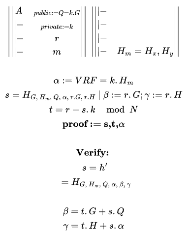

Zero-Knowledge Scalable Transparent ARguments of Knowledge (zk-STARKs) do not require a trusted setup because they are built entirely using transparent cryptographic primitives, mainly collision-resistant hash functions (e.g., SHA-256, Keccak). 

# 🔐 What is a "trusted setup"?
In some zero-knowledge proof systems like zk-SNARKs, a trusted setup phase generates common reference strings (CRS) that are later used to create and verify proofs. If this setup is compromised (e.g., if someone saves the toxic waste—secret trapdoor info), they can **forge proofs** and **break soundness**.

## ✅ How zk-STARKs avoid the need for trusted setup
1. Transparent Setup:
- zk-STARKs use public randomness, not secret trapdoors.
- This randomness can be generated from well-known, unpredictable sources (e.g., Bitcoin block hash at a certain height), which everyone can verify.

2. No Elliptic Curve Pairings or Structured Reference Strings:
- zk-STARKs avoid complex algebraic structures (e.g., elliptic curves, pairings) that require carefully crafted parameters.
- Instead, they rely only on hash functions and finite fields, which don’t need trapdoors.

3. Proofs from First Principles:
- STARKs use algebraic constraint satisfaction and encode computation as polynomials.
- They apply techniques like Reed–Solomon encoding, Low-Degree Testing (LDT), and Fast Fourier Transforms (FFT) over finite fields—none of which require secret randomness.

4. Public Verifiability and Fiat–Shamir:
- To make the proof non-interactive, zk-STARKs use the Fiat–Shamir heuristic, turning interactive steps into hash queries.
- Since hash functions are deterministic and public, this maintains full transparency.

--- 
- 🧪 Trusted Setup = Making the decoder ring
- 🔓 Danger = If the ring's creation was dishonest, the whole system is compromised.

Instead of a secret decoder ring, you use:
- A public dice roll to choose which parts to reveal (e.g., from a shared YouTube livestream timestamp).
- Only basic tools like magnifying glasses and rulers (i.e., hash functions and math anyone can check).

💡 It’s like a puzzle contest where the fairness of the rules doesn’t depend on trusting the organizer.

zk-STARKs can use a Verifiable Random Function (VRF) or other sources of public randomness to ensure transparency without trusted setup. 


### 🧩 The Key Insight
- zk-SNARK: Secret tools (trusted setup) are required to verify.
- zk-STARK: Uses only public, shared tools. No need to trust anyone beforehand.

---

## 🔄 Comparison to zk-SNARKs

| Feature             | zk-STARK           | zk-SNARK                          |
| ------------------- | ------------------ | --------------------------------- |
| Trusted Setup       | ❌ Not needed       | ✅ Needed (in most versions)       |
| Cryptographic Basis | Hash functions     | Elliptic curve pairings           |
| Quantum Resistance  | ✅ Yes (hash-based) | ❌ No (depends on elliptic curves) |
| Proof Size          | ❌ Larger           | ✅ Smaller                         |
| Verification Speed  | ✅ Fast             | ✅ Fast                            |

<hr>


## 🔐 VRF (Verifiable Random Function)
Imagine the judge uses a magic dice roller that:
- Generates a random number (e.g., 57)
- Also gives you a proof that this number was rolled fairly
- Everyone can verify the roll was honest using public math

📜 Example:

> "Here’s the random seed: Qb7c2, and here's a proof it's fair based on my public key."

This is a VRF — it gives you randomness + verifiability.

## 🏗️ How This Replaces Trusted Setup
In zk-SNARKs:
- You might hide a trapdoor key in the setup (like a rigged dice).
- If someone keeps that trapdoor, they can fake proofs.

In zk-STARKs with VRFs:
- You use a publicly verifiable random seed (from a VRF, Bitcoin block hash, or NIST beacon).
- This randomness decides what parts of the proof to check.
- No trapdoor → no cheating.

💡 A VRF ensures unpredictability + auditability, which is perfect for zk-STARKs:
- No trusted party
- No secret trapdoor

Randomness is transparent and reproducible

| Feature               | zk-STARK with VRF                     |
| --------------------- | ------------------------------------- |
| Setup                 | ✅ Fully public                        |
| Randomness            | ✅ From VRF / public seed              |
| Trusted Setup Needed? | ❌ No                                  |
| Security Assumption   | ✅ Based on hashes & public randomness |


## ✨ VRF

A **Verifiable Random Function (VRF)** allows the owner of a private key to generate a hash output of some input data, **along with a proof** that the output was computed correctly. Anyone with the corresponding public key can **verify the proof** — without needing to trust the generator.

This is useful in zero-knowledge settings like zk-STARKs to derive **transparent randomness**, replacing the need for a trusted setup.

---

## 🔐 Math Overview

Alice owns a private key \( k \), and her public key is:

$$
Q = k \cdot G
$$

Where \( G \) is the base point on the elliptic curve.

---

### Step 1: Hash Message to Curve

Select a message \( m \), and hash it to a point:

$$
(H_x, H_y) = H_1(m)
$$

---

### Step 2: Generate VRF Output

Compute the VRF output:

$$
\text{VRF} = k \cdot H
$$

Generate scalar challenge:

$$
s = H_2(G, H, kG, \text{VRF}, rG, rH)
$$

Then compute:

$$
t = r - sk \mod N
$$

Where \( N \) is the order of the curve.

---

### Step 3: Proof and Verification

The proof is the tuple:

$$
(s, t, \text{VRF})
$$

To verify, Bob computes:

$$
(t + ks) \cdot G = t \cdot G + s \cdot Q
$$

And:

$$
(t + ks) \cdot H = t \cdot H + s \cdot \text{VRF}
$$

Now recompute the challenge:

$$
h_2' = H_2(G, H, Q, \text{VRF}, tG + sQ, tH + s \cdot \text{VRF})
$$

If \( h_2' = s \), the proof is valid.

---



```
$$

 \left | \begin{vmatrix}
 A  &_{public:= Q = k.G}   \\
 |-  &_{private:= k}  \\
 |-  &r  \\
 |-  &m  \\
\end{vmatrix}
\right |  

\  
 \left | \begin{vmatrix}
 |-  &   \\
 |-  &  \\
 |-  &  \\
 |-  &H_m = {H_x, H_y}  \\
\end{vmatrix}
\right |  

\\ \\
\alpha := VRF = k.H_m

\\
s = H_{G, \ H_m, \ Q, \ \alpha, \ r.G, \ r.H}
\ | \ \beta := r.G; \gamma := r.H
\\
t= r - s.k \mod N
\\
\textbf{proof := s,t,} \alpha
\\
\\
\textbf{Verify: }
\\ \ s = h'
\\ \ = H_{G, \ H_m, \ Q, \ \alpha, \ \beta, \ \gamma}
\\
\\
\beta = t.G + s.Q  
\\
\gamma = t.H + s.\alpha

$$
```

---

## VRF Methodology for Verifiable Randomness and Leader Selection
This methodology outlines the generation and verification of deterministic, verifiable randomness using a cryptographic VRF construction, ensuring fairness, unpredictability, and resistance to manipulation in distributed systems (e.g., consensus, lottery, leader election).

1. Randomness Generation
2 main approaches for randomness generation:

A. Pseudorandom Number Generator (PRNG)

```
PRNG(seed || key) → number_random_00, proof
```
- Produces an initial random number with a verifiable output.
- proof can be a hash or deterministic transformation tied to the seed and key.

A PRNG alone doesn't provide verifiability. Only the VRF part is truly "verifiable randomness".

B. VRF-Based Randomness
```
VRF(seed || key, key_secret) → value_random_01, proof
```
- A secret key is used to generate a unique, verifiable random value and proof.
- Ensures that randomness is unique and tamper-evident.

2. Signature-Based Randomness
To ensure uniqueness and reduce collision risk:

```
sign(seed, key_secret) → signature
hash(signature) → number_random
verify(signature, key_public, seed) → True/False
```

- BLS Signatures are preferred for uniqueness guarantees.
- Signature verification ensures the integrity of the source randomness.

BLS signatures are a good choice because they are:
- Unique (reducing collision risk)
- Aggregateable (useful in distributed protocols)


3. Verifiability
To verify the random output:

```
verify_VRF(value_random, key_public, proof, seed) → True/False
```
or

```
verify(signature, key_public, seed) → True/False
```

Ensures that outputs were indeed derived from the claimed seed/key pair.

4. Application: Leader Selection via Bernoulli Sampling

```
VRF(seed || round || steps, key_secret) → value_random_output_VRF, proof
```
Output is bounded:

```
value_random_output_VRF < x
```

Apply a hash to this VRF output for deterministic bucketing:

```
hash(value_random_output_VRF) → bucket_index ∈ [0, w)
```

Binomial trial model:
- B(k,w,p) with:
	- w: number of trials (tickets)
	- p: probability of winning
	- k: winning tickets
	- j: selected winners based on bucket index

Bernoulli trial: 1 trial per participant, you are sampling B(1, p).

✅ VRFs use a secret key to produce a random output and proof, which can be verified using the public key.

